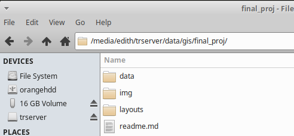

# Spatial distribution of nuclear power plants

## Abstract

About 250 words summarizing your goal, analysis steps, and conclusions. Hint: Write this last (but put it first)

## Purpose/Inquiry Question

## Background/Rationale and sources
* Nuclear power is the only non-carbon power source capable of non-cyclic, high-output production!
* Nuclear power can be made safer by adequate human factors research

### Sources
[Wikipedia's excellent listing of nuclear plants](https://en.wikipedia.org/wiki/Nuclear_power_in_the_United_States#/media/File:NRC_regions_and_plant_locations_2008.jpg) in the US inspires awe and wonder.

US Homeland Security provides a comprehensive dataset of all power stations in the US as a [ESRI shapefile](https://hifld-geoplatform.opendata.arcgis.com/datasets/ee0263bd105d41599be22d46107341c3_0?geometry=124.651%2C-16.847%2C-150.622%2C72.114)

## Analysis Steps
11. directory setup
I created a simple directory structure for organizing project data:

11. gather data
11. analyze results
11. change the world!

## Results and Discussion

## Conclusions: 

## Limitations: 

## Future research: 
